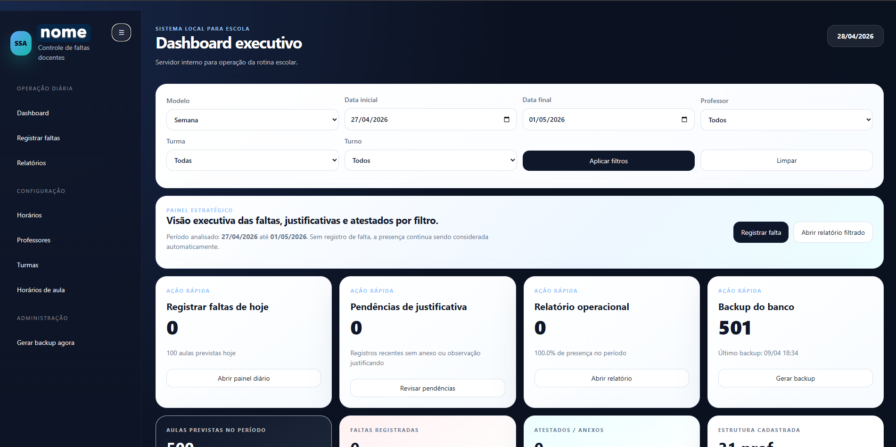
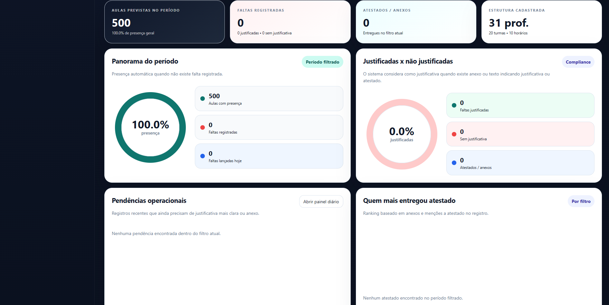
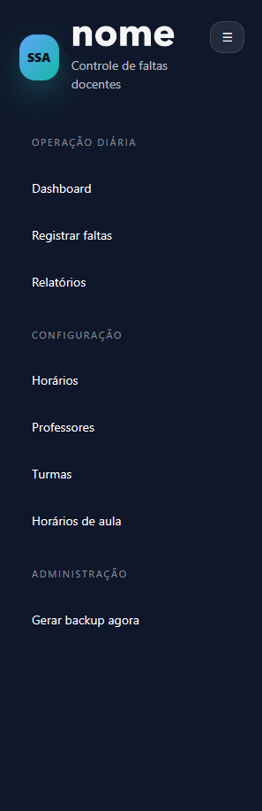
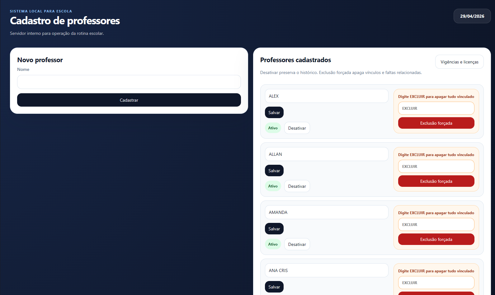
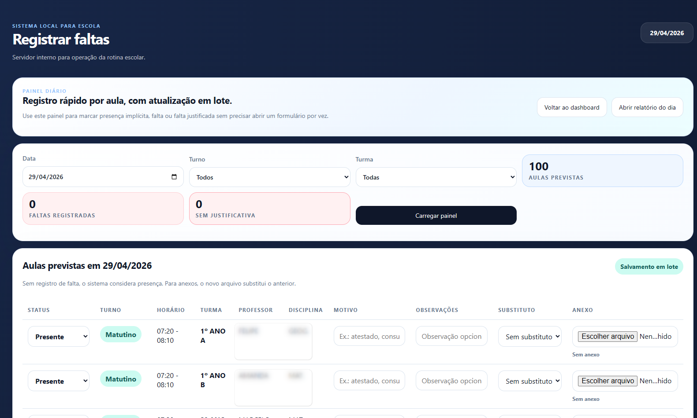
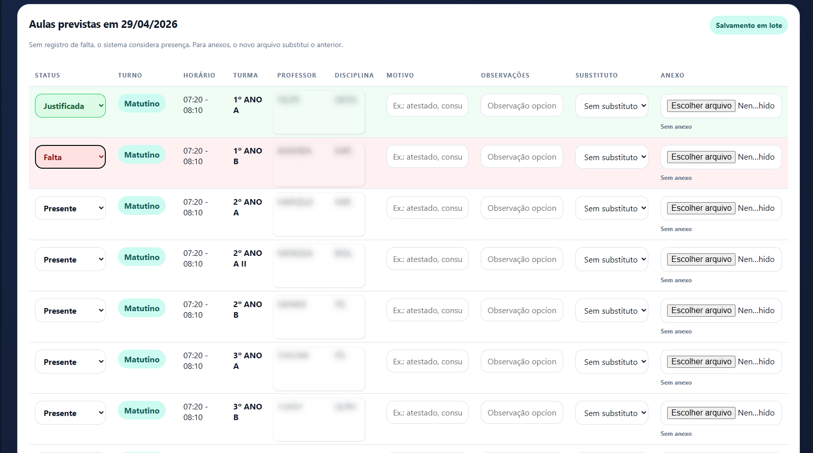
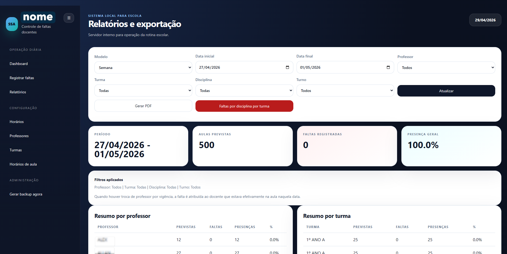
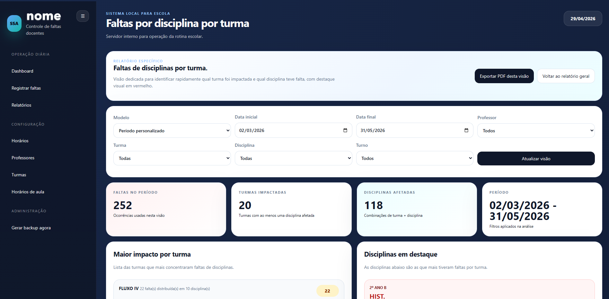

# Pulse Escolar — Controle de Faltas Docentes


Sistema web local desenvolvido em **Python + Flask** para auxiliar instituições de ensino no controle de faltas de professores, organização de horários, acompanhamento de justificativas e geração de relatórios administrativos em PDF.

O projeto foi criado com foco em uma rotina escolar real, onde a presença do professor é considerada automaticamente quando não existe registro de falta para uma aula prevista.

---

## 📌 Objetivo do projeto

O **Pulse Escolar** tem como objetivo centralizar o controle operacional de faltas docentes, permitindo que a equipe administrativa registre ausências, acompanhe justificativas, consulte dados por período e gere relatórios de forma rápida.

A solução ajuda a reduzir controles manuais em planilhas, melhora a organização das informações e facilita a tomada de decisão por meio de dashboards e relatórios filtrados.

---

## 🚀 Funcionalidades principais

- Dashboard executivo com visão geral das faltas, presenças, justificativas e atestados.
- Registro diário de faltas com base na grade de horários cadastrada.
- Regra automática de presença: se não houver falta registrada, a presença é considerada válida.
- Cadastro e edição de professores, turmas e horários de aula.
- Controle de períodos, licenças e vigências de professores.
- Gestão de alocações temporárias e substituições.
- Registro de justificativas com opção de anexar documentos.
- Relatórios por semana, mês ou período personalizado.
- Filtros por professor, turma, turno e disciplina.
- Exportação de relatórios em PDF.
- Backup automático do banco de dados em alterações importantes.
- Interface responsiva com menu lateral, cards, filtros e tabelas operacionais.

---

## 🛠️ Tecnologias utilizadas

| Tecnologia | Uso no projeto |
|---|---|
| Python | Linguagem principal da aplicação |
| Flask | Framework web utilizado no backend |
| SQLite | Banco de dados local |
| HTML5 | Estrutura das telas |
| CSS3 | Estilização da interface |
| Jinja2 | Renderização dinâmica dos templates |
| OpenPyXL | Leitura/importação de planilhas Excel |
| ReportLab | Geração de relatórios em PDF |
| Werkzeug | Tratamento seguro de uploads |

---

## 🧩 Estrutura do projeto

```bash
pulse-escolar/
├── app.py
├── import_schedule.py
├── requirements.txt
├── README.md
├── .gitignore
├── iniciar_sistema.bat
├── iniciar_sistema.sh
├── data/
│   └── planilhas_exemplo.xlsx
├── static/
│   └── style.css
├── templates/
│   ├── base.html
│   ├── dashboard.html
│   ├── absences.html
│   ├── schedule.html
│   ├── report.html
│   ├── report_class_subjects.html
│   ├── teachers.html
│   ├── teacher_periods.html
│   ├── classes.html
│   └── timeslots.html
├── instance/
│   └── .gitkeep
└── uploads/
    └── justificativas/.gitkeep
```


## 📊 Relatórios disponíveis

O sistema permite gerar relatórios administrativos com base em filtros de período, professor, turma, turno e disciplina.

Exemplos de relatórios:

- Resumo de faltas por professor.
- Resumo de faltas por turma.
- Resumo de faltas por disciplina.
- Relação detalhada de faltas registradas.
- Visão de impacto por turma e disciplina.
- Exportação em PDF para uso administrativo.

---

## 📎 Upload de justificativas

O sistema permite anexar documentos relacionados às justificativas de faltas.

Formatos aceitos:

- PDF
- PNG
- JPG/JPEG
- WEBP
- DOC/DOCX

Limite padrão de upload: **10 MB**.

---

## 🖼️ Prints do sistema


```markdown
## 📷 Demonstração

### Dashboard principal


### Dashboard 


### Menu Lateral


### Cadastro de professores


### Registro de faltas


### Justificativas


### Relatórios em PDF


### Relatórios em PDF por turma

```

## 📌 melhorias em andamento

- Implementar autenticação de usuários.
- Criar níveis de acesso para secretaria, coordenação e administrador.
- Exportar relatórios também em Excel.
- Adicionar testes automatizados.
- Separar melhor as camadas de rotas, serviços e banco de dados.
- Adicionar variáveis de ambiente para configurações sensíveis.
- Criar versão online com deploy em servidor ou plataforma cloud.
- Melhorar a documentação técnica da modelagem do banco.

---

## 🎯 Aprendizados demonstrados neste projeto

   Conhecimentos práticos em:

- Desenvolvimento web com Flask.
- Manipulação de banco de dados SQLite.
- Criação de dashboards administrativos.
- Organização de rotinas escolares e regras de negócio.
- Geração de relatórios PDF.
- Upload e controle de anexos.
- Importação de dados via Excel.
- Estruturação de sistema local para uso operacional.

---

## 👨‍💻 Autor

Desenvolvido por **Ailton Junior.**

Para adquirir o projeto completo, entre em contato. 
